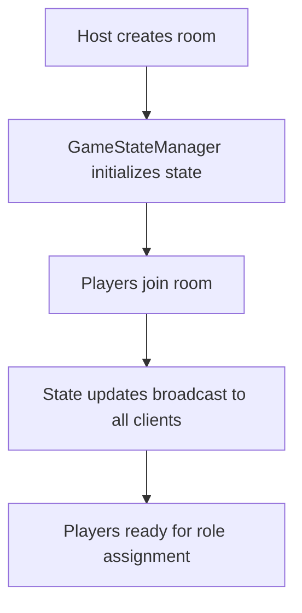
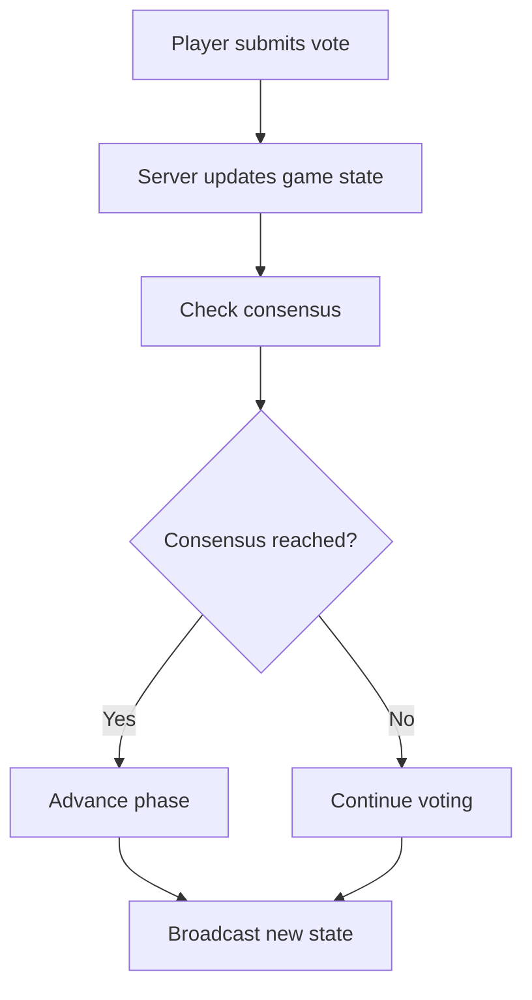

# Werewolf Mafia Game - State-Based Architecture Documentation

## Overview
This document outlines the implementation of a robust, state-based architecture for the Werewolf Mafia multiplayer game, replacing the previous event-driven system. The primary goal is to make the host app fully authoritative with players as viewing clients, simplifying reconnection logic with a 90-second timeout system.

## Architecture Goals

### Primary Objectives
1. **Host Authority**: Host app becomes the single source of truth for game state
2. **Player Clients**: Players act as viewing clients that receive state updates
3. **Simplified Reconnection**: 90-second timeout system for automatic reconnection
4. **State Consistency**: All clients maintain synchronized game state
5. **Robust Error Handling**: Graceful handling of disconnections and network issues

### Key Benefits
- Eliminates race conditions from event-driven architecture
- Simplifies debugging and testing
- Provides clear separation of concerns
- Enables easy state persistence and recovery

## Implementation Progress

### ✅ Step 1: Enhanced GameStateManager Implementation
**Status**: Complete

**Changes Made**:
- Fixed GameStateManager import path issues
- Enhanced GameStateManager with helper functions:
  - `getAliveNonMafiaPlayers()`
  - `getMafiaPlayers()`
  - `getAlivePlayers()`
- Added `getHostGameState()` for host-specific state views
- Updated `getPlayerGameState()` to accept helper functions
- Refactored server to use `GameStateManager.updateGameState()` for all state changes
- Fixed disconnect handler crashes with proper null checks
- Added missing `reconnectTokens` Map declaration
- Added legacy `PLAYERS_UPDATE` event for backward compatibility

**Results**: Basic game flow (lobby → role assignment → night phase) working successfully.

### ✅ Step 2: State-Based Voting System
**Status**: Complete

**Changes Made**:
- Converted voting handlers to use `GameStateManager.updateGameState()`:
  - `MAFIA_VOTE` handler
  - `DOCTOR_HEAL` handler
  - `SEER_INVESTIGATE` handler
- Enhanced `getPlayerGameState()` to include:
  - Voting state information
  - Consensus timers
  - Heal status
  - Investigation results
- Updated player client to receive all voting info from state
- Simplified player voting handlers to only send events
- Added `investigationResults` Map for storing seer results
- Created `checkMafiaVoteConsensusWithVotes()` helper function

**Results**: Voting system fully converted to state-based architecture.

### ✅ Step 3: Host App State Synchronization
**Status**: Complete

**Problem Solved**: Host app was stuck on "waiting for players to confirm roles" while players were in night phase due to incomplete state-based conversion.

**Changes Made**:
- Added `host-game-state-update` event listener to host app
- Enhanced `getHostGameState()` to include `playerReadiness` array in expected format
- Added proper state transitions for host app
- Maintained backward compatibility during transition

**Results**: Host and player apps now properly synchronized through state updates.

## Technical Architecture

### Server-Side Components

#### GameStateManager
**Location**: `apps/server/gameStateManager.js`

**Core Functions**:
```javascript
// State management
updateGameState(roomId, newState)
getGameState(roomId)

// Player-specific state views
getPlayerGameState(playerId, gameState, helpers)

// Host-specific state views
getHostGameState(gameState)

// Helper functions
getAliveNonMafiaPlayers(players)
getMafiaPlayers(players)
getAlivePlayers(players)
```

**State Broadcasting**:
- `GAME_STATE_UPDATE` events sent to players
- `host-game-state-update` events sent to host
- Legacy events maintained for compatibility

#### Server Event Handlers
**Location**: `apps/server/index.js`

**Key Principles**:
- All state changes go through `GameStateManager.updateGameState()`
- Centralized state broadcasting
- Proper error handling with null checks
- Disconnect handling with cleanup

### Client-Side Components

#### Player App
**Location**: `apps/player/src/App.jsx`

**State Management**:
- Primary state source: `GAME_STATE_UPDATE` events
- Local state minimal, mainly for UI interaction
- Voting actions send events but don't manage state

#### Host App
**Location**: `apps/host/src/App.jsx`

**State Management**:
- Primary state source: `host-game-state-update` events
- Full game state visibility
- Authoritative control over game flow

## Current System Flow

### 1. Game Initialization


### 2. State Update Flow
```mermaid
graph TD
    A[Player action] --> B[Server receives event]
    B --> C[GameStateManager.updateGameState()]
    C --> D[State broadcast to players]
    C --> E[Host state update]
    D --> F[Player UI updates]
    E --> G[Host UI updates]
```

### 3. Voting Process


## Configuration

### Timeout Settings
- **Reconnection Timeout**: 90 seconds
- **Vote Timeout**: Configurable per phase
- **Consensus Check Interval**: 1 second

### Event Types
- `GAME_STATE_UPDATE`: Player state updates
- `host-game-state-update`: Host state updates
- Legacy events maintained for backward compatibility

## Testing Strategy

### Unit Tests
- GameStateManager state transitions
- Helper function accuracy
- State view generation

### Integration Tests
- Client-server state synchronization
- Voting consensus logic
- Reconnection handling

### End-to-End Tests
- Complete game flow
- Multiple player scenarios
- Network failure simulation

## Deployment History

### Commits Made
1. "Step 1: Implement state-based architecture with enhanced GameStateManager"
2. "Fix: Correct GameStateManager import path in server"
3. "Fix: Resolve disconnect handler crash preventing player joins"
4. "Fix: Add legacy PLAYERS_UPDATE event for host compatibility"
5. "Step 2: Convert voting system to state-based architecture"
6. "Step 3: Fix host app state synchronization"

## Next Steps

### Phase 4: Enhanced Reconnection System
- Implement 90-second timeout with automatic reconnection
- Add reconnection token validation
- Improve state recovery for reconnected players

### Phase 5: State Persistence
- Add database persistence for game states
- Implement state recovery after server restart
- Add game history tracking

### Phase 6: Performance Optimization
- Optimize state broadcasting frequency
- Implement differential state updates
- Add state compression for large games

## Known Issues

### Resolved
- ✅ Server crashes due to import path issues
- ✅ Disconnect handler crashes
- ✅ Host-player state synchronization
- ✅ Voting system state consistency

### Monitoring
- Memory usage with large numbers of concurrent games
- WebSocket connection stability
- State update performance with many players

## Maintenance Notes

### Code Organization
- GameStateManager: Central state management
- Event handlers: Minimal logic, delegate to GameStateManager
- Client apps: Receive state, render UI, send actions

### Best Practices
- Always use `GameStateManager.updateGameState()` for state changes
- Maintain backward compatibility during transitions
- Add comprehensive error handling
- Document state structure changes

---

**Last Updated**: [Current Date]
**Version**: 1.0
**Status**: Active Development 